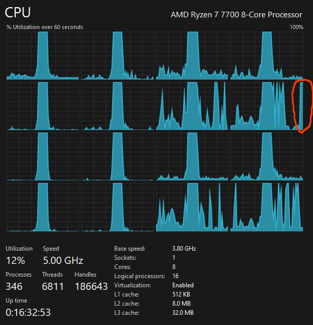
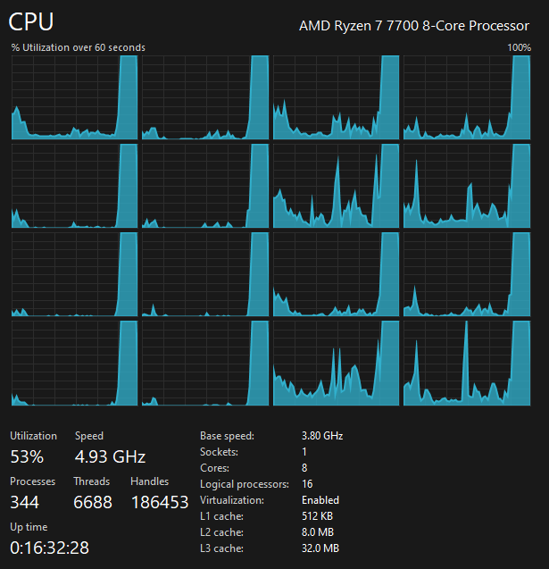

# Quick test of multithreading in C++ using Intel's TBB library
The test is for how much time is spent doing 100 x fibbonacci(40) in a single thread vs multithreaded.
- Result for multithreading debug build (16 logical processors): ~9 seconds
- Result for single thread debug build: ~73 seconds

## Single threaded (debug build)
Calculating fibbonacci(40) 100 times in a single thread gave these results on my system:
```
Time taken in single threaded system to calculate fib(40): 72.9999s
single threaded vector (first 3):
102334155 | 102334155 | 102334155 |
```


## Multi threaded (debug build)
Calculating fibbonacci(40) 100 times multithreaded gave these results on my 16 logical processors system:
```
Time taken in multithreaded system to calculate fib(40): 9.10323s
concurrent vector (first 3):
102334155 | 102334155 | 102334155 |
```


## Release build results:
- fibonnacci(40) 100 times:
	- Single threaded: 3.17961s
	- Multithreaded: 0.31893s
	```
	Time taken in multithreaded system to calculate fib(40): 3.17961s
	concurrent vector (first 3):
	102334155 | 102334155 | 102334155 |

	Time taken in single threaded system to calculate fib(40): 0.31893s
	single threaded vector (first 3):
	102334155 | 102334155 | 102334155 |
	```
- fibonnaci(43) 100 times:
	- Single threaded: 12.8587s
	- Multithreaded: 1.35241s
	```
	Time taken in multithreaded system to calculate fib(43): 12.8587s
	concurrent vector (first 3):
	433494437 | 433494437 | 433494437 |

	Time taken in single threaded system to calculate fib(43): 1.35241s
	single threaded vector (first 3):
	433494437 | 433494437 | 433494437 |
	```